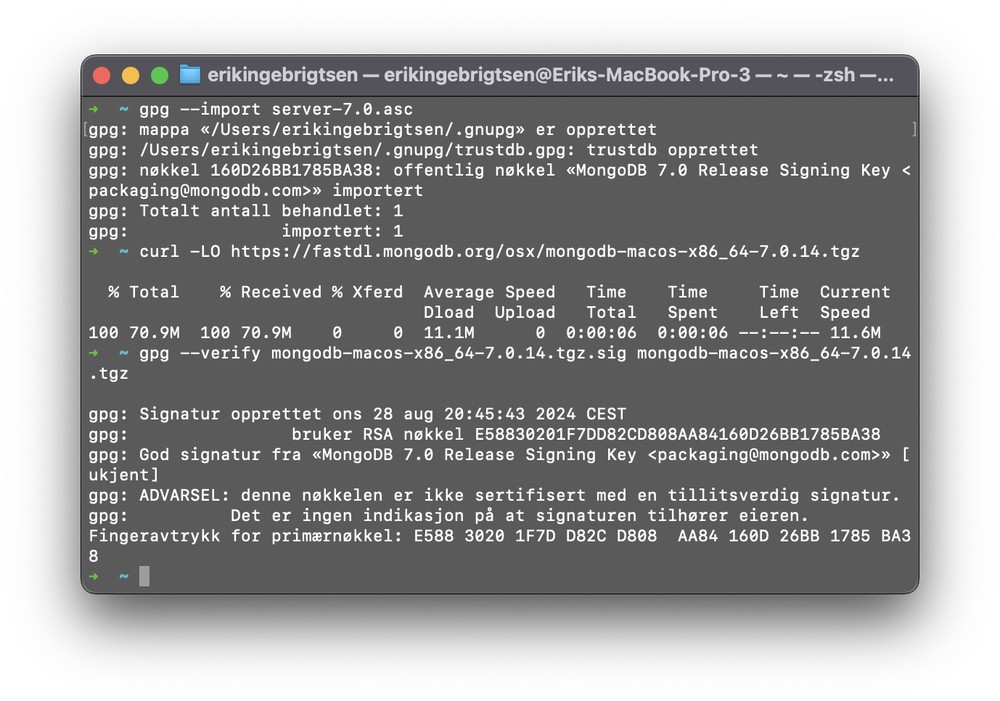
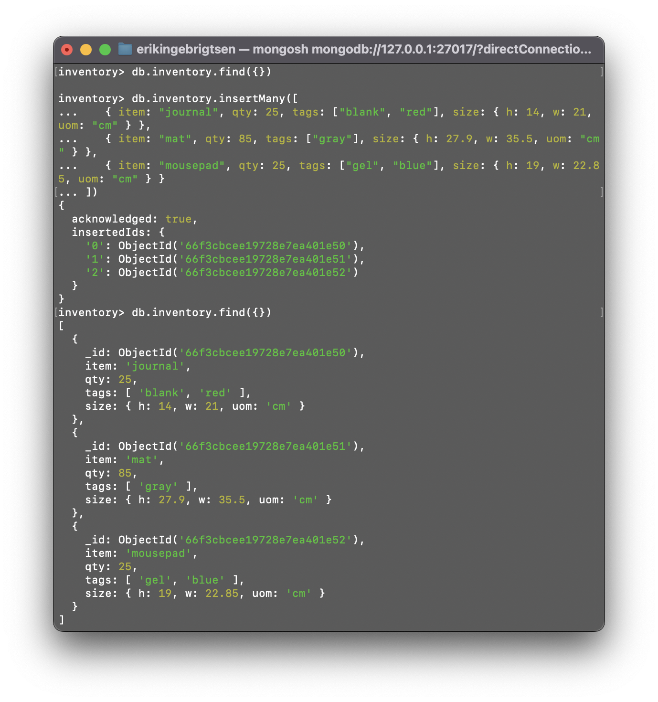
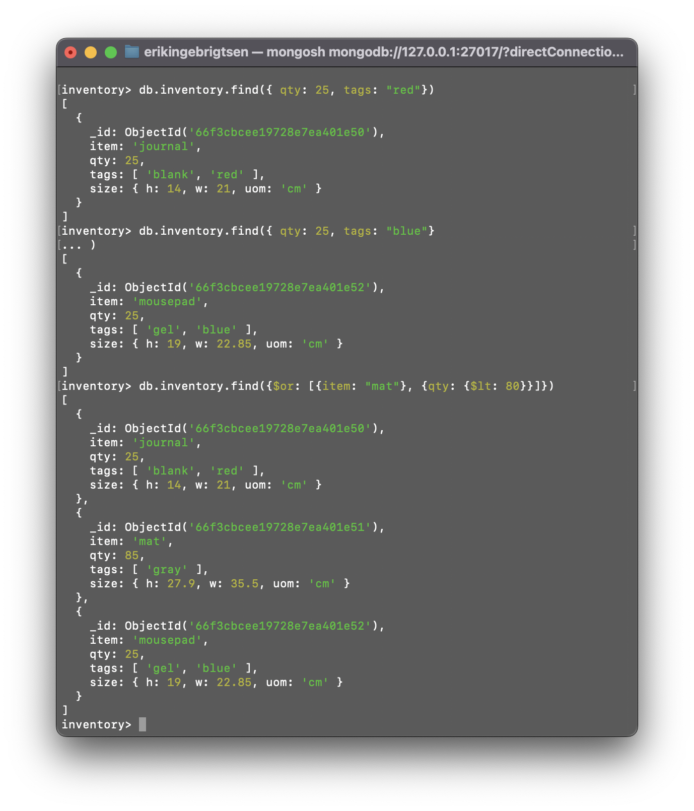
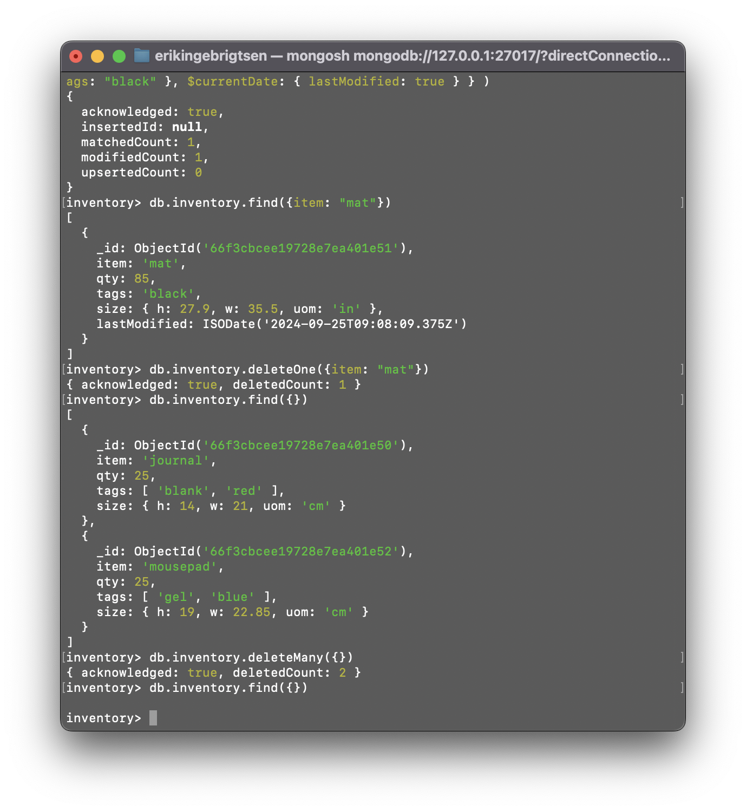
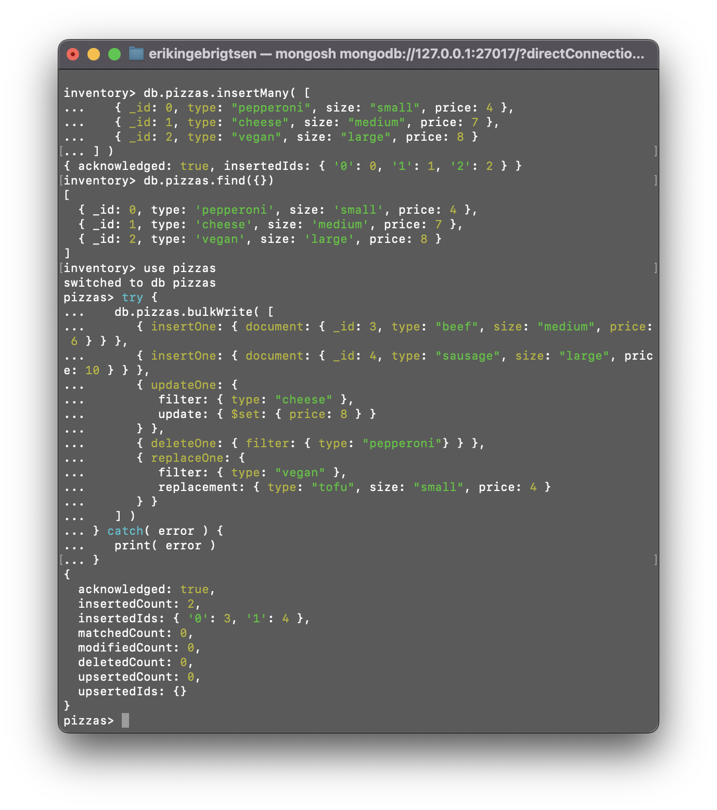
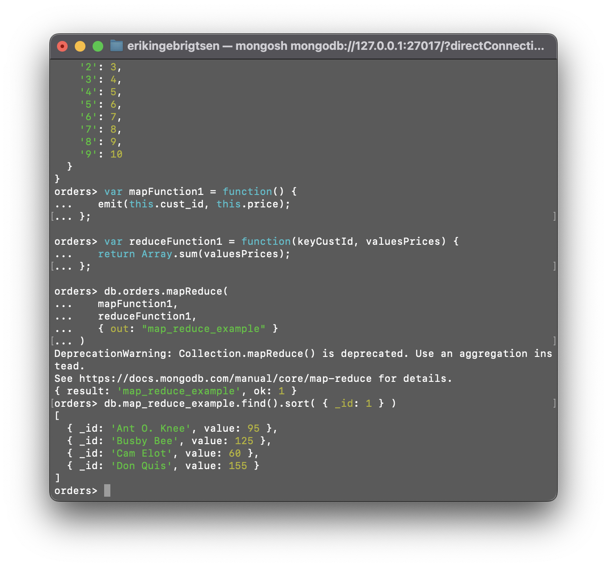
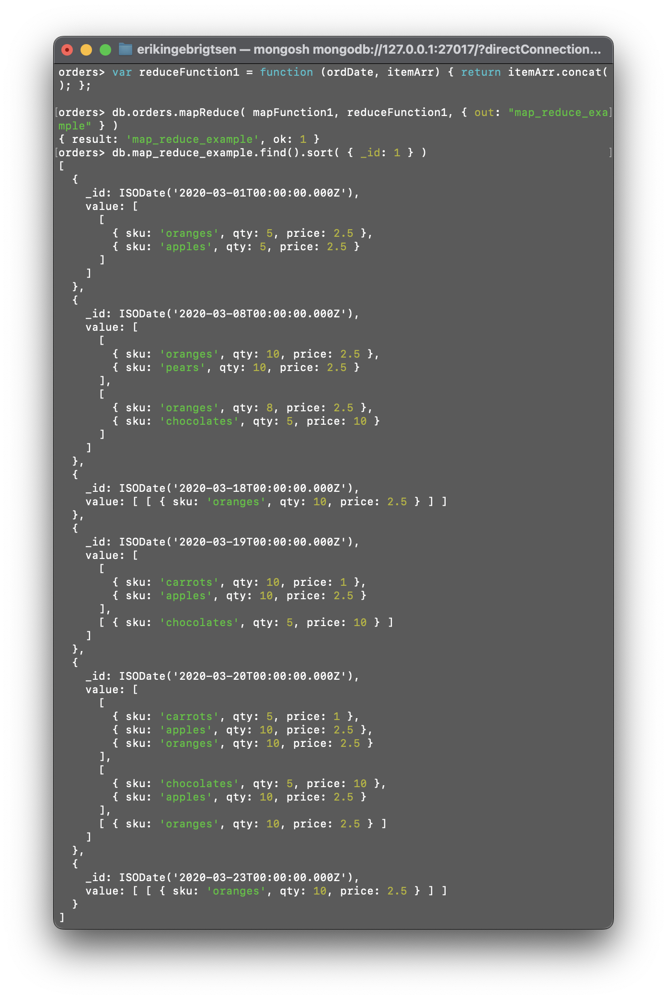
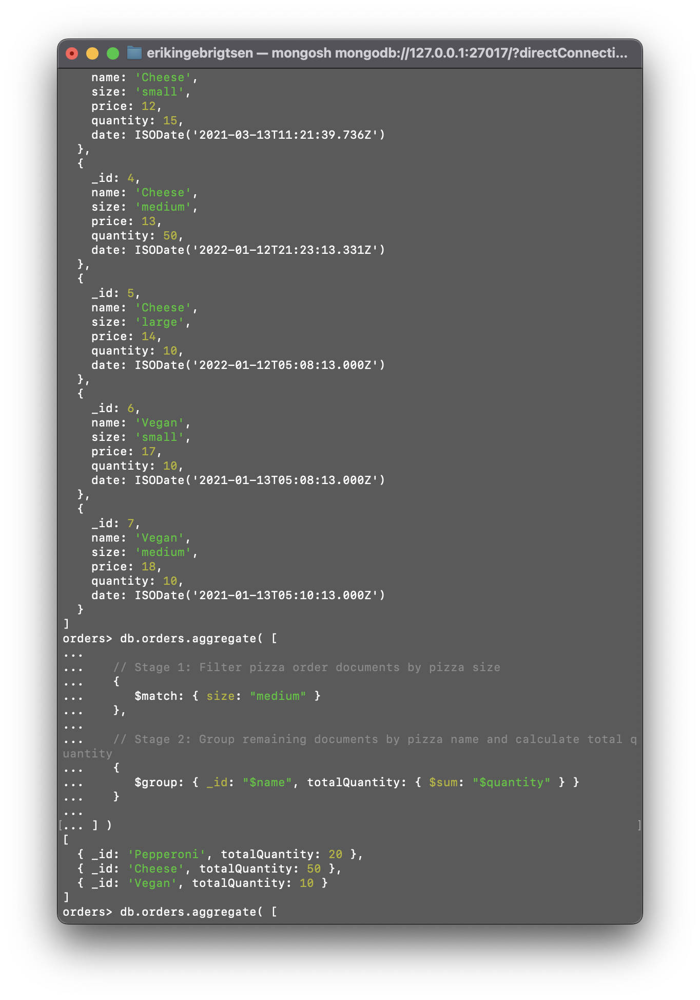
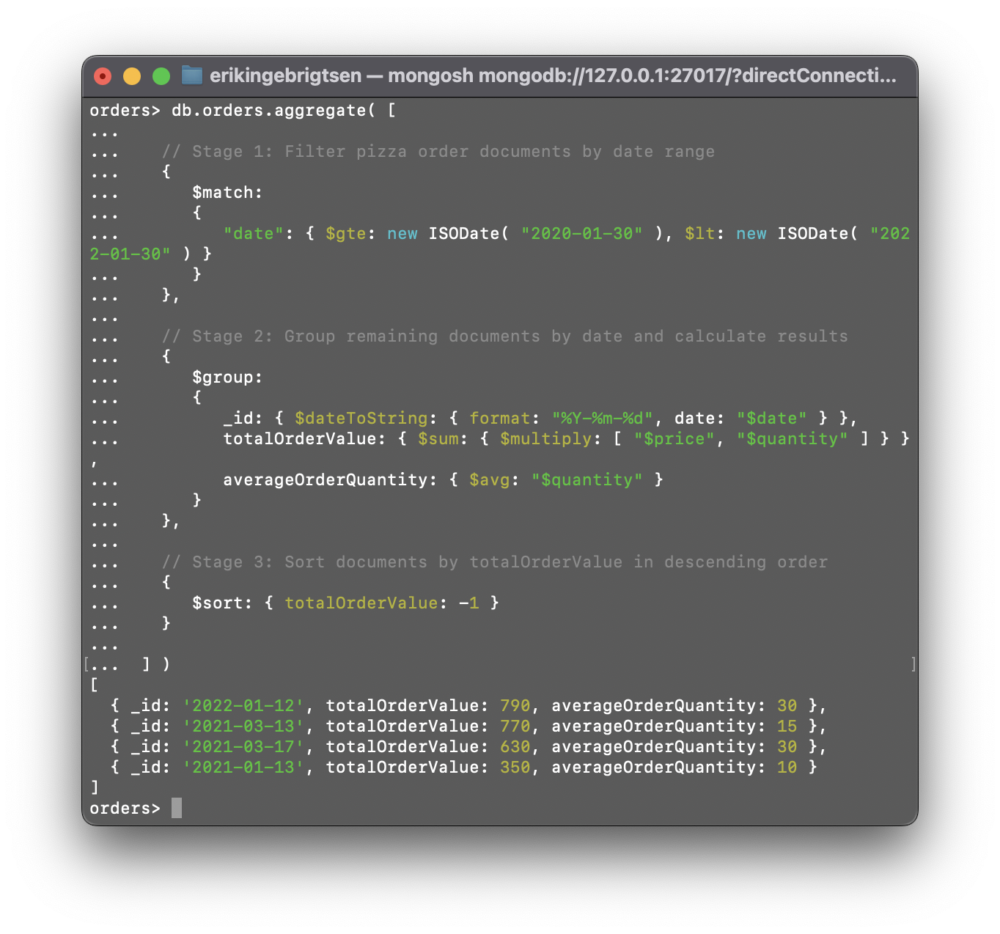

# Screenshots:

Validation:

I used homebrew to install, and didnt check the validation, as brew does this automatically. Still i followed the steps in the tutorial ang got this result.

## CRUD operations:

Insert:

Query:

Delete:

Bulk write:

## Map reduce

Tutorial reduce:

Modified the sample code to reduce by the date and concatenate the lists of items together.
So for a given date you get all ordered items.

## Aggregate

